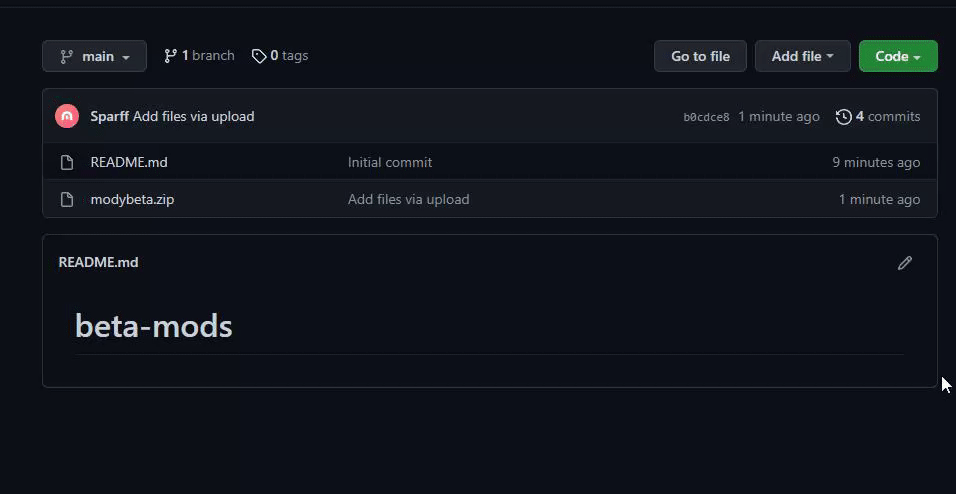

# Jak pobrać mody?

Kliknij zielony przycisk z napisem ***CODE***. Ukaże Ci sie małe menu wyboru. Naciśnij wtedy przycisk ***Download ZIP***.

# Jak wgrać mody do Discord Bot Maker'a?

1. W programie *Discord Bot Maker* najedź na zakładkę *Project* i kliknij *Open actions directory*.
2. Otworzy Ci się folder. Pobrane mody, wypakuj do folderu. Jeżeli wyskoczy Ci informacja o istniejących plikach - Zamień je!
3. Gotowe! Mody zostały wgrane!
